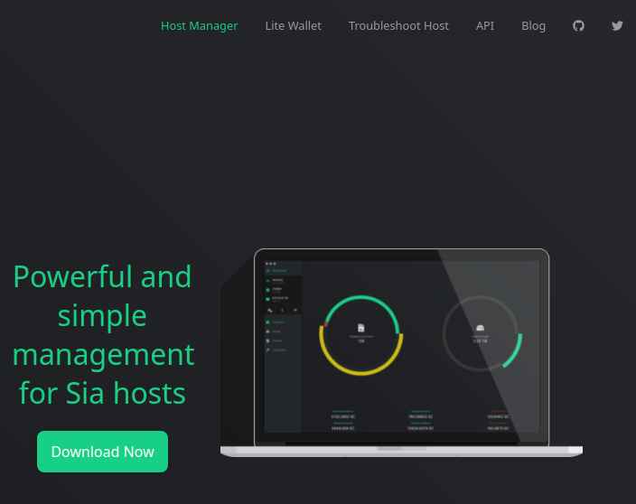
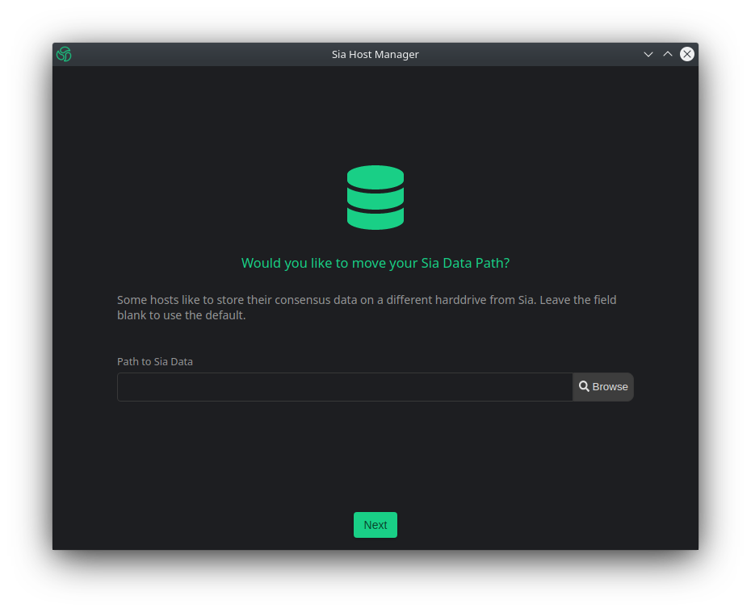

# Setting up Host Manager on a remote host

## Step 1: Installing Host Manager
To install the latest version of Host Manager visit the [official website](https://siacentral.com/host-manager/) and click the "Download Now" button.



From the list, download which ever binary works for your operating system.


## Step 2: Retrieve hosts api-password
In order to configure the host properly, we will need to first retrieve the password for our hosts API. This can be found under the `.sia` folder on your hosts root directory.

For Linux systems you can used the following. Your API password is a 32 character string as seen below.
```
$ cd ~/.sia
$ cat apipassword
1234abc5de67fab8c9d0e1fa2b345cd6
```

## Step 3: Create SSH tunnel to host API port
Next you will need to establish a SSH tunnel to the API Port of your Sia Host machine. To do so use the following command. 

```
$ ssh -f user@hostdomain -L 9980:localhost:9980 -N
```    

## Step 4: Configure remote connection
Launch Host Manager and once loaded make sure "Show Advanced" has been selected and click "Get Started"


Next you will be asked if you would like to link Host Manager to a SiaUI. Select "No Thanks".


Next you will be asked to specify a path to your Sia data. Leave the input blank and click "Next".



Next you will be prompted to configure your Daemon settings. If you have used all the default ports you can leave everything black except for the "API Password" field. For that enter the API password you retrieved during Step 2. Once all the required fields have been filled in click "Next".


Congratulations, you have now succefully connected Host Manager to your host.


---
*Written by: Skunk_Ink, Last Edit: Jan 25, 2022*
